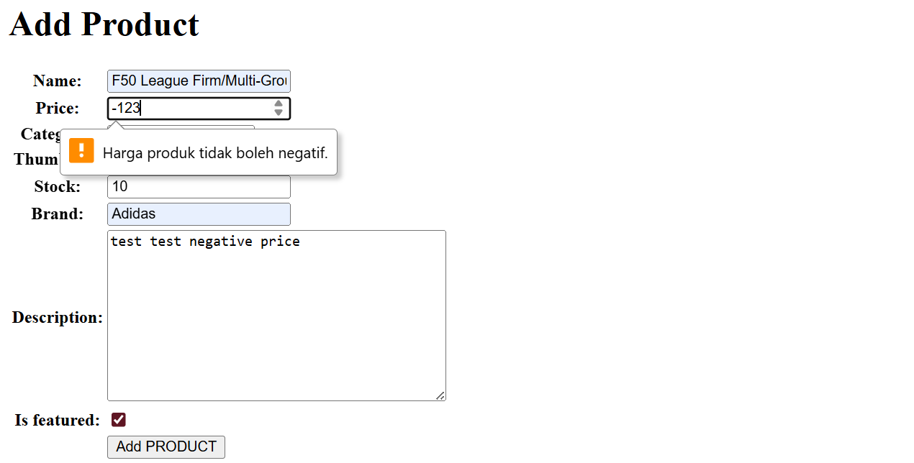
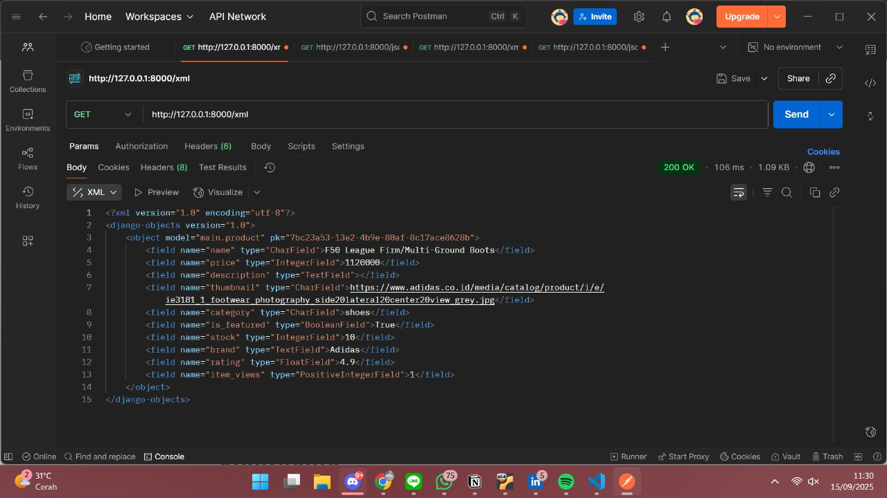
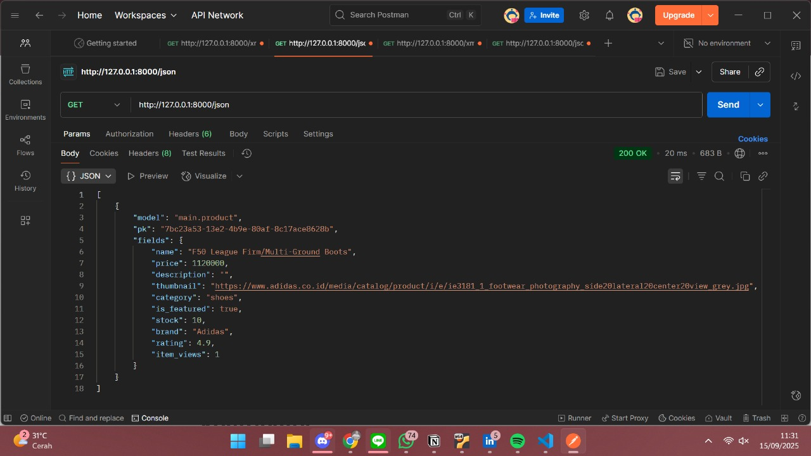
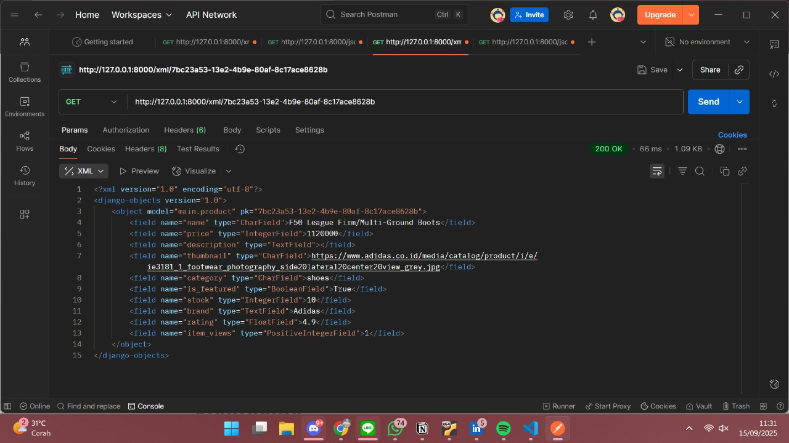
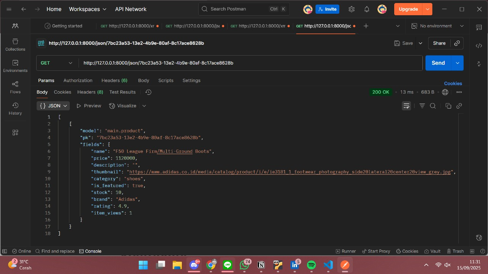

# PBP 2025/2026

```
Nama  : Nisrina Alya Nabilah
NPM   : 2406425924
Kelas : PBP C
```
<details>
<summary><b>Tugas Individu 2</b></summary>

## TUGAS INDIVIDU 2

Tautan menuju aplikasi PWS yang sudah di deploy : https://nisrina-alya-xoccerverse.pbp.cs.ui.ac.id/
Tautan menuju github : https://github.com/alyaanaazz/xoccer-verse

### 1. Menjelaskan bagaimana mengimplementasikan **checklist secara step-by-step**
- Saya memulai proyek ini dengan membuat folder terlebih dahulu melalu terminal / command prompt kemudian menginisiasi direktori yang buat ke repository kosong dengan command:
    ```
    C:\Users\nisri>D:
    D:\>cd "FASILKOM UI"
    D:\FASILKOM UI>mkdir xoccer-verse
    D:\FASILKOM UI>cd xoccer-verse
    D:\FASILKOM UI\xoccer-verse> git init\
    ```

- Setelah membuat direktori baru, saya mengaktifkan Virtual Environment (env) untuk mengisolasi package serta dependencies dari aplikasi agar tidak bertabrakan dengan versi lain yang ada pada device saya dengan command:
    ```
    env\Scripts\activate
    ```

- Setelah mengaktifkan environment, di dalam direktori `xoccer-verse` saya membuat file `requirements.txt` dan menambahkan beberapa dependencies yang dipisahkan di masing-masing line. kemudian saya melakukan instalasi terhadap dependencies yang ada di berkas `requirements.txt` dengan command:
    ```
    pip install -r requirements.txt
    ```

- Setelahnya, saya membuat proyek django untuk project saya yang bernama `xoccer_verse` dengan command:
    ```
    django-admin startproject xoccer_verse .
    ```

Setelah membuat proyek Django dengan command tersebut, Django akan membuat struktur direktori dengan folder utama `xoccer_verse` berisi file `settings.py`, `urls.py`, dan lain-lain, serta file `manage.py` di luar folder tersebut.

- Selanjutnya, saya perlu memisahkan fitur ke dalam modul, karena itu, saya membuat apo bernama `main` dengan command:
    ```
    python manage.py startapp main
    ```
setelah itu, folder baru bernama `main` terbentuk dengan struktur `models.py`, `views.py`, `tests.py`, dan `apps.py`.

- Selanjutnya, supaya app `main` dapat dikenali oleh project, saya menambahkan `main` pada variable `INSTALLED_APPS` di file `xoccer_verse/settings.py`:
    ```
    INSTALLED_APPS = [
        ...,
        'main',
    ]
    ```

- Pada `main/models.py`, saya membuat model `Item` dengan atribut berikut:
    ``` 
    class Item(models.Model):
        name = models.CharField(max_length=100)
        price = models.IntegerField()
        description = models.TextField()
        thumbnail = models.URLField(blank=True, null=True)
        category = models.CharField(max_length=20, choices=CATEGORY_CHOICES, default='update')
        is_featured = models.BooleanField(default=False)
        stock = models.IntegerField()
        brand = models.TextField()
        rating = models.FloatField(default=0.0)

        def __str__(self):
            return self.name
    ```
model ini merepresentasikan barang yang dijual di app saya.

- Melakukan migrasi database supaya struktur database sesuai dengan model yang sudah dibuat dengan command:
    ```
    python manage.py makemigrations
    python manage.py migrate
    ```

- Menambahkan URL routing, dengan membuat file `urls.py` di direktori `main` untuk mapping views nya dengan melakukan:
    ```
    from django.contrib import admin
    from django.urls import path
    from django.urls import path, include

    urlpatterns = [
        path('admin/', admin.site.urls),
        path('', include('main.urls')),
    ]
    ```

- Untuk melakukan test sementara untuk memastikan apakah app nya works, saya menjalankan 
    ```
    python manage.py runserver
    ```

- selanjutnya, setelah memastikan app saya berjalan lancar, saya membuat file `.gitignore` dan mulai menginisialisasikan ke `Github` supaya file file confidential (seperti env, etc.) tidak ikut ter-push di github saya, lalu melakukan inisialisasi repository ke Github.

- setelah itu, berpedoman dari tutorial 1, saya mengimplemntasikan template dasar dengan membuat direktori templates yang berada di dalam direktori main.

- setelahnya, saya membuat dan mengisi berkas `main.html` sesuai dengan instruksi di dokumen Tugas 2 yang berisi nama apps, serta data diri saya yang meliputi nama, npm, dan kelas PBP saya.

- Selanjutnya saya menambahkan konfigurasi untuk `memulai deployment ke PWS`.

- setelah berhasil melalui proses deployment di PWS, situs web saya untuk Tugas 2 ini sudah siap dikumpulkan melalui tautan berikut : https://nisrina-alya-xoccerverse.pbp.cs.ui.ac.id/

- Hampir lupa bikin unit test :p, jadi saya melanjutkan bikin Unit Testing untuk menguji halaman utama, menguji jika client mengakses url yang tidak ada maka Django akan mengeluarkan kode `404 (Not Found)`, menguji pembuatan objek item baru dengan atribut tertentu, menguji nilai default dari model Item, menguji fungsionalitas method `increment_views()`, serta menguji properti `is_hot_sale()` dengan 21 views dianggap hot sale.

### 2. Bagan yang berisi request client ke web aplikasi berbasis Django beserta responnya dan penjelasan kaitan antara urls.py, views.py, models.py, dan berkas html

[Link : https://www.canva.com/design/DAGyAFXXlsM/lKLV6CJ1YqI_PCwj1RIv4Q/edit?utm_content=DAGyAFXXlsM&utm_campaign=designshare&utm_medium=link2&utm_source=sharebutton]
- Setiap request yang masuk akan diproses oleh urls.py dan akan diteruskan ke `views.py` yang sesuai. Jika request berhubungan dengan data, maka `views.py` akan melakukan query ke `models.py` dan `database`. Hasil query akan dikembalikan lagi ke views.py. Setelah itu, hasil yang sudah diperoleh akan dikembalikan lagi ke client dalam bentuk `HTML` sebagai response.

### 3. Peran settings.py dalam proyek Django
[Referensi Jawaban Nomor 3: https://www.colabcodes.com/post/a-complete-guide-to-settings-py-in-django-configuration-for-your-python-web-project]

- berkas `settings.py` di dalam proyek Django bukan hanya configuration file biasa, namun, `settings.py` memiliki peran yang sangat penting untuk proyek Django, beberapa alasannya adalah:
    - Mengontrol Database Configuration, seperti Database engine(e.g MySQL, SQLite, etc.), detail connection seperti user, password, host, dan port yang dalam kasus pbp, para mahasiswa PBP mendapat akses detail connection dari credential yang diterima dari ITF FASILKOM UI, `settings.py` juga mengatur configurations lebih lanjut lainnya.
    - Mengatur `Installed Applications` dan `Middleware`, yang dapat di lihat pada `INSTALLED_APPS` list di `settings.py` di proyek Django dimana Django atau pihak ketiga berperan aktif di proyek Django saat ini.
    - Menyimpan data sensitif keamanan, yang dimana Django akan memerlukan `SECRET_KEY` yang merupakan string penting yang digunakan untuk pengamanan cryptography terhadap keamanan proyek
    - Mengatur behavior proyek di environment yang berbeda dengan beberapa configurations yang berbeda misal DEBUG, etc.

### 4. Cara kerja migrasi database di Django
[Referensi jawaban nomor 4: Django Documentations (https://docs.djangoproject.com/id/5.2//topics/migrations/)]

- Setelah saya melakukan perubahan pada model, misalnya menambahkan atau menghapus model lama, saya akan menjalankan perintah berikut untuk membuat migrasi:
    ```python manage.py makemigrations```
Contoh output:
    ```
    Migrations for 'main':
    main\migrations\0001_initial.py
        + Create model Products
    ```
Pada tahap ini, Django akan memindai model saya, kemudian membandingkan dengan versi yang tersimpan pada berkas migrasi sebelumnya, lalu membuat berkas migrasi baru. Hal yang harus dipastikan ketika membuat migrasi adalah selalu membaca hasil outputnya untuk memastikan perubahan yang terdeteksi sesuai dengan yang diharapkan. Setelah file migrasi berhasil dibuat, jalankan perintah berikut untuk menerapkan migrasi ke database:
    ```
    python manage.py migrate
    ```

Contoh keluaran:
    ```
    Operations to perform:
    Apply all migrations: admin, auth, contenttypes, main, sessions
    Running migrations:
    Applying main.0001_initial... OK
    ```

Jika migrasi sudah diterapkan dengan baik, commit perubahan model dan berkas migrasi tersebut ke dalam sistem kontrol (github atau pws) dalam satu commit. Dengan begitu, jika ada developer lain (atau server production) yang menarik code tersebut akan langsung mendapatkan model yang telah diperbarui beserta migrasinya.

### 5. Pendapat pribadi terkait alasan framework Django yang dijadikan permulaan pembelajaran pengembangan perangkat lunak dari semua framework yang ada
- Menurut saya, Django dijadikan permulaan dalam pembelajaran pengembangan perangkat lunak karena framework ini lengkap (batteries included) dan terstruktur, sehingga mahasiswa bisa langsung fokus mempelajari konsep inti seperti arsitektur MVT, manajemen database dengan ORM, serta best practice dalam pemisahan logika bisnis, data, dan tampilan tanpa harus repot dengan mengintegrasikan banyak library. Django juga menyediakan fitur keamanan bawaan, dokumentasi yang sangat lengkap, serta komunitas yang besar sehingga memudahkan pemula seperti mahasiswa yang baru memulai journey nya di dunia pengembangan perangkat lunak untuk mencari referensi dan solusi. Selain itu, dengan Django mahasiswa dapat membangun framework web end-to-end mulai dari model, backend, hingga interface sederhana, menjadikannya sarana belajar yang relevan di industri karena banyak digunakan untuk aplikasi berskala besar yang membutuhkan keamanan, kecepatan pengembangan, dan skalabilitas.

### 6. Feedback umtuk asisten dosen tutorial 1 yang sudah saya kerjakan sebelumnya.
- Thank you so much buat Kak Farrell yang selalu ngecek update-an tutorial dari asdosannya walaupun online😭 Dan untuk Tugas 2 ini, shout out juga buat Kak Farrell, karena fast-respond dan sabar banget jawabin nya. Big thanks dan respeecttt kaakk, semoga sehat selalu.
</details>

---

<details>
<summary><b>Tugas Individu 3</b></summary>

## TUGAS INDIVIDU 3

### 1. Mengapa kita memerlukan data delivery dalam pengimplementasian sebuah platform?
- Data delivery diperlukan dalam mengimplementasikan sebuah platform karena data delivery memungkinkan developer untuk mengirim data dari server ke client dengan cepat dan efisien. Data delivery juga digunakna ketika kita perlu mengirimkan data dalam berbagai format seperti XML, JSON, dan format data lainnya. Data delivery juga membuat aplikasi web menjadi lebih responsif dan interaktif, karena data dapat diambil dan ditampilkan secara real-time.
Data delivery juga memungkinkan developer untuk mengirim data ke berbagai perangkat seperti desktop, mobile, dan tablet. Dengan menggunakan data delivery, developer nya bisa membuat aplikasi web yang responsif dan dapat diakses dari berbagai perangkat. Selain itu, dengan menggunakan data delivery, developers dapat membuat aplikasi web yang scalable dan dapat diakses dari berbagai lokasi.

### 2. Pendapat pribadi mengenai yang lebih baik antara XML dan JSON? Mengapa JSON lebih populer dibandingkan XML?
[Referensi jawaban nomor 2: 
"https://www.domainesia.com/berita/perbedaan-json-dan-xml/", 
"https://www.mamika.id/remaja-pendidikan/json-dan-xml-format-data-umum-mana-yang-lebih-unggul-36099"]

Menurut saya, JSON <b>lebih baik</b> daripada XML, karena beberapa alasan yaitu:
- JSON memiliki sintaks yang lebih sederhana dan ringkas dibandingkan XML. Bentuknya mudah dibaca dan ditulis manusia namun juga mudah untuk diparsing oleh mesin, hal ini membuat JSON menjadi format yang efisien untuk transfer data.
- Ukuran file JSON cenderung lebih kecil daripada XML, sehingga dapat mempercepat proses transfer data.
- JSON lebih flexible dalam menangani beberapa jenis data, mulai dari string, integer, boolean, hingga array dan object.
- Banyak teknologi modern dan API web mendukung JSON secara native. Hal ini membuatnya menjadi pilihan yang lebih mudah untuk diintegrasikan dalam berbagai platform dan bahasa pemrograman. Salah satunya, JSON sudah secara alami terintegrasi dengan JavaScript, sehingga menjadikannya pilihan yang sangat baik untuk pengembangan web.


### 3. Fungsi dari method is_valid() pada form Django dan mengapa kita membutuhkan method tersebut?
- Method `is_valid()` pada form Django adalah fungsi yang digunakan untuk melakukan validasi data yang dikirimkan pengguna melalui form. Fungsi ini memeriksa apakah data yang masuk sesuai dengan kriteria yang telah ditentukan dalam definisi form, seperti tipe data, lalu apakah field tersebut wajib diisi atau tidak (required fields), dan batasan - batasan lain yang kita (developer) tetapkan dalam validasi. `is_valid()` sangat penting karena ia memastikan bahwa data yang masuk ke dalam sistem aman dan dapat diproses tanpa menimbulkan error.

### 4. Mengapa kita membutuhkan csrf_token saat membuat form di Django? Apa yang dapat terjadi jika kita tidak menambahkan csrf_token pada form Django? Bagaimana hal tersebut dapat dimanfaatkan oleh penyerang?
- Kita membutuhkan csrf_token saat membuat form di Django untuk mencegah serangan `Cross-Site Request Forgery (CSRF)`, di mana penyerang bisa memanipulasi pengguna yang sah untuk melakukan aksi tidak diinginkan di aplikasi web saat pengguna tersebut masih terautentikasi. Jika `csrf_token` tidak ditambahkan pada form Django, aplikasi menjadi rentan terhadap serangan tersebut. Penyerang dapat membuat permintaan berbahaya, seperti mengubah kata sandi atau mengirim email palsu, yang tampak berasal dari pengguna yang sah, karena aplikasi kita tidak dapat memverifikasi bahwa permintaan tersebut benar-benar berasal dari pengguna tersebut.

### 5. Bagaimana cara kamu mengimplementasikan checklist di atas secara step-by-step (bukan hanya sekadar mengikuti tutorial).
- ... melanjutkan dari `Tugas Individu 2`
- membuat skeleton yang berfungsi sebagai kerangka views dari situs web nantinya, dengan cara:
    - Membuat direktori `templates` pada root folder dan membuat file html baru bernama `base.html` yang nantinya akan di extend oleh template turunan, sehingga tinggal mengganti template tags sesuai kebutuhan di templates turunannya.
    - Menambahkan `base.html` ke `xoccer_verse/settings.py` di variable `TEMPLATES` supaya `base.html` teridentifikasi sebagai file template.
    - Pada direktori `main`, saya membuat file baru bernama `forms.py` untuk membuat stuktur form yang dapat menerima data product terbaru dengan:
        ```
        from django.forms import ModelForm
        from main.models import Product

        class ProductForm(ModelForm):
            class Meta:
                model = Product
                fields = ["name", "price", "category", "thumbnail", "is_featured", "stock", "brand", "rating"]
        ```
    - Menambahkan import pada `main/views.py` juga meng-update beberapa function yaitu:
        ```
        ...
        from main.forms import ProductForm
        from main.models import Product

        def show_main(request):
            context = {
                ...
                'product_list' : product_list
            }

        def create_product(request):
            ...

        def show_product(request, id):
            ...
        ```
    - Meng-import function function dan menambahkan path URL yang sudah dibuat di `main/vews.py` ke dalam variable `urlpatterns`:
        ```
            ...
            from main.views import show_main, create_product, show_product, show_xml, show_json, show_xml_by_id, show_json_by_id

            ...

            urlpatterns = [
                ...
                path('create-product/', create_product, name='create_product'),
                path('product/<str:id>/', show_product, name='show_product'),
                path('xml/', show_xml, name='show_xml'),
                path('json/', show_json, name='show_json'),
                path('xml/<str:product_id>/', show_xml_by_id, name='show_xml_by_id'),
                path('json/<str:product_id>/', show_json_by_id, name='show_json_by_id'),
            ]
        ```
    - Menambahkan button `+ Add` yang akan rediret ke halaman form:
        ```
            
            <p>Belum ada data berita pada football news.</p>
            

            
            <div>
            <h2><a href="">{{ news.title }}</a></h2>

            <p><b>{{ news.get_category_display }}</b> | 
                <b>Featured</b> | 
                <b>Hot</b> | <i>{{ news.created_at|date:"d M Y H:i" }}</i> 
                | Views: {{ news.news_views }}</p>

            
            
            <br />
            

            <p>{{ news.content|truncatewords:25 }}...</p>

            <p><a href=""><button>Read More</button></a></p>
            </div>

            <hr>
            

            
        ```
    - Membuat dua berkas HTML baru pada direktori `main/templates` untuk halaman form input dan detail produk.
        1. `create_product.html` : yang berisi `` yg merupakan token yang berfungsi sebagai security dan juga `{{ form.as_table }}` yg merupakan template tag yang digunakan untuk menampilkan fields form yang sudah dibuat pada forms.py sebagai table. ada insight dari temen (Raida, PBP C, makasih raida) kalo harga nya harus di validasi :p, jadi saya menambahkan code berikut di `templates/create_product.html` untuk mem-validasi harga yang diinput bukan negative number:
            ```
            <script>
            const priceInput = document.getElementById('id_price');

            if (priceInput) {
                priceInput.addEventListener('input', function() {
                if (this.value < 0) {
                    this.setCustomValidity('Harga produk tidak boleh negatif.');
                } else {
                    this.setCustomValidity('');
                }
                });
            }
            </script>
            ```
        - jika user menginput negative numbers, forms akan otomatis mengeluarkan info seperti ini:
        

        2. `product_detail.html` : Mengeluarkan tampilan ketika client memencet button `Detail`. 
    
    - Menambahkan URL deployment PWS ke `CSRF_TRUSTED_ORIGINS` di `settings.py`
        ```
        ...
        ALLOWED_HOSTS [...]

        CSRF_TRUSTED_ORIGINS = [
            "https://nisrina-alya-xoccerverse.pbp.cs.ui.ac.id/"
        ]
        ```

    - Mengembalikan data dalam bentuk `XML` menggunakan `HttpsResponse` dan `Serializers` juga dalam bentuk `JSON` dengan menambahkan `return function` dengan function:
        ```
        def show_xml(request):
            ...

        def show_json(request):
            ...
        ```

    - Mengembalikan Data berdasarkan ID dalam bentuk XML dan JSON dengan  function:
        ```
        def show_xml_by_id(request, product_id):
            ...
            
        def show_json_by_id(request, product_id):
            ...
        ```
    
    - Test `Request` dan `Response` melalui `Postman` (hasil dari `Postman` dilampirkan di akhir)

### 6.  Apakah ada feedback untuk asdos di tutorial 2 yang sudah kalian kerjakan?
Aman kak, makasih banyak 🙏🙏

## Hasil akses URL pada Postman
1. Hasil akses URL XML `(http://127.0.0.1:8000/xml)` pada postman:


2. Hasil akses URL JSON `(http://127.0.0.1:8000/json)` pada postman:


3. Hasil akses URL XML by ID `(http://127.0.0.1:8000/xml/[product_id])` pada postman:


4. Hasil akses URL JSON by ID`(http://127.0.0.1:8000/json/[product_id])` pada postman:


</details>

## TUGAS INDIVIDU 4

### 1. Apa itu Django AuthenticationForm? Jelaskan juga kelebihan dan kekurangannya?
[Referensi jawaban nomor 1 : Geeks for Geeks (https://www.geeksforgeeks.org/python/user-authentication-system-using-django/), 
Django Documentation (AuthenticationForm https://docs.djangoproject.com/en/stable/topics/auth/default/#django.contrib.auth.forms.AuthenticationForm)]

- `AuthenticationForm` adalah sebuah form bawaan dalam framework `Django` yang dirancang khusus untuk menangani proses user authentication, yaitu proses login. Form ini secara otomatis memeriksa validasi kredensial (`username` dan `password`) yang dimasukkan oleh pengguna. Ketika pengguna mengirimkan data melalui form ini, `AuthenticationForm` akan memeriksa apakah username tersebut ada di database dan apakah password yang diberikan cocok dengan pengguna tersebut. Jika valid, form ini akan mengembalikan user object yang telah diautentikasi.
- Kelebihan `Django AuthenticationForm`:
    - sudah dilengkapi dengan berbagai fitur keamanan standar yang sangat penting. ini termasuk perlindungan terhadap serangan CSRF dan validasi data yang aman untuk mencegah injection
    - karena sudah disediakan oleh Django, penggunaannya menjadi lebih mudah, hanya perlu meng-import dari `django.contrib.auth.forms` dan menambahkannya ke `template` dan `view`.
    - jika pengguna salah memasukkan username atau password, form ini secara `otomatis` akan menghasilkan pesan kesalahan yang jelas, seperti `"Please enter a correct username and password."` sehingga tidak perlu membuat logika untuk menangani setiap kemugkinan kesalahan secara manual.
- Kekurangan `Django AuthenticationForm`:
    - Secara bawaan, `AuthenticationForm` dirancang untuk autentikasi menggunakan `username`. Jika Anda ingin pengguna bisa login menggunakan alamat email sebagai pengganti username, Anda perlu membuat form kustom sendiri 
    - Secara default, form ini menghasilkan field username dan password, sehingga jika ingin mengubah label, menambahkan placeholder, atau menerapkan kelas CSS tertentu langsung dari form, prosesnya bisa sedikit lebih rumit daripada membuat form dari nol.

### 2.  Apa perbedaan antara autentikasi dan otorisasi? Bagaiamana Django mengimplementasikan kedua konsep tersebut?
- Mengutip dari `Geeks for Geeks`, `Autentikasi atau Authentication` adalah proses verifikasi identitas pengguna atau sistem untuk memastikan mereka memang benar-benar orang yang di klaim nya. Sedangkan `Otorisasi atau Authorization` adalah proses menentukan dan memberikan hak akses kepada pengguna atau sistem yang di autentikasi. Singkatnya, autentikasi adalah proses untuk memastikan `siapa user?` sedangkan otorisasi adalah proses untuk menentukan `hak akses` dari user yang telah di autentikasi. 

- Django mengimplementasikan kedua konsep tersebut:
[Referensi: Hadi Soufan on Medium (https://medium.com/munchy-bytes/django-authentication-vs-authorization-understanding-the-difference-for-user-creation-b2ac8e294864)]
    - Ketika pengguna login, hal yang pertama terjadi adalah proses `authentication`. Ini melibatkan verifikasi identitas pengguna dengan mencocokkan username dan password yang mereka masukkan dengan yang tersimpan di database. Jika cocok, pengguna akan dianggap "authenticated" dan session akan dibuatkan untuk mereka, yang berfungsi sebagai tanda bahwa pengguna telah terverifikasi. Setelah pengguna "authenticated", sistem kemudian melakukan `authorization` untuk menentukan halaman atau fungsi apa saja yang bisa diakses oleh pengguna tersebut berdasarkan perannya atau level hak akses yang dimilikinya. Authentication di Django diimplementasikan melalui modul bawaan yang disebut `django.contrib.auth`. Modul ini menyediakan segala yang dibutuhkan untuk mengelola proses otentikasi, seperti User Model yang akan menyimpan informasi pengguna seperti username, password (yang dienkripsi), email, serta informasi lainnya, lalu modul ini juga menyediakan fungsi-fungsi bawaan lainnya seperti `authenticate()` dan `login()`.

### 3.  Apa saja kelebihan dan kekurangan session dan cookies dalam konteks menyimpan state di aplikasi web?
[Referensi : Geeks for Geeks (https://www.geeksforgeeks.org/javascript/difference-between-session-and-cookies/)]
- Kelebihan utama `session` adalah keamanan yang lebih tinggi karena data disimpan di sisi server, sehingga informasi sensitif seperti ID user tidak terekspos langsung ke client. Session juga mampu menampung data yang jauh lebih besar dibandingkan cookies. Namun, kekurangannya adalah membebani server karena membutuhkan sumber daya penyimpanan untuk setiap pengguna aktif, dan data sesi akan hilang saat browser ditutup (kecuali dikonfigurasi khusus). Sebaliknya, `cookies` memiliki kelebihan dalam persistensi, di mana data dapat disimpan di browser pengguna untuk jangka waktu yang lama, bahkan setelah browser ditutup, dan tidak membebani server. Akan tetapi, kelemahan mendasarnya adalah keamanan yang lebih rendah karena data disimpan di sisi client, membuat cokies rentan terhadap manipulasi atau pencurian (XSS), serta memiliki kapasitas penyimpanan yang sangat terbatas (sekitar 4KB).

### 4. Apakah penggunaan cookies aman secara default dalam pengembangan web, atau apakah ada risiko potensial yang harus diwaspadai? Bagaimana Django menangani hal tersebut?
- Tidak, penggunaan cookies tidak aman secara default dalam pengembangan web. Ada beberapa risiko keamanan potensial yang signifikan yang harus diwaspadai oleh developer. Django, sebagai kerangka kerja web yang matang, menyediakan beberapa mekanisme bawaan untuk mengurangi risiko-risiko ini secara efektif.
- Risiko keamanan cookies : Cookies disimpan di browser pengguna (sisi klien), yang membuatnya rentan terhadap berbagai serangan jika tidak dikelola dengan benar. Sumber : docs.djangoproject.com/en/stable/topics/security/, https://owasp.org/www-community/attacks/xss/, https://owasp.org/www-community/attacks/xss/
    - `Cross-Site Scripting (XSS)`: Penyerang dapat menyuntikkan skrip berbahaya ke situs web yang kemudian dieksekusi di browser pengguna. Skrip ini dapat mencuri data cookie, termasuk session ID, yang memungkinkan penyerang untuk membajak sesi pengguna dan meniru identitas mereka. 🦹‍♂️
    - `CSRF`: Serangan ini memaksa pengguna yang sudah terautentikasi untuk melakukan tindakan yang tidak diinginkan di aplikasi web. Misalnya, seorang penyerang dapat membuat halaman web palsu yang berisi permintaan tersembunyi untuk mentransfer dana dari akun bank korban, dan jika korban mengunjungi halaman tersebut saat sedang login ke banknya, permintaan itu akan dieksekusi menggunakan cookie sesi korban.
    - `Session Hijacking (Pembajakan Sesi)`: Jika cookies ditransmisikan melalui koneksi HTTP yang tidak terenkripsi, penyerang dapat mengendus (sniffing) lalu lintas jaringan, mencuri cookie sesi, dan mendapatkan akses tidak sah ke akun pengguna. 
- Django menerapkan prinsip "aman secara default" dengan menyediakan beberapa lapisan perlindungan terhadap ancaman terkait cookies
    - Perlindungan CSRF: Django memiliki perlindungan CSRF yang diaktifkan secara default. Mekanisme ini bekerja dengan menempatkan token rahasia dan unik di setiap formulir POST. Ketika formulir dikirim, Django memverifikasi bahwa token yang dikirim kembali oleh client cocok dengan yang diharapkan. Ini mencegah penyerang melakukan permintaan palsu atas nama pengguna, karena mereka tidak akan memiliki akses ke token CSRF yang benar.
    - Atribut Cookie yang Aman: Django memungkinkan pengembang untuk dengan mudah mengatur atribut keamanan pada cookies melalui settings file (`settings.py`):
        - SESSION_COOKIE_SECURE = True: Pengaturan ini memastikan bahwa cookie sesi hanya dikirim melalui koneksi HTTPS yang aman dan terenkripsi, mencegah session hijacking melalui penyadapan jaringan.

        - SESSION_COOKIE_HTTPONLY = True: Ini adalah pengaturan default. Atribut HttpOnly mencegah cookie diakses oleh JavaScript di sisi klien. Ini adalah pertahanan yang sangat efektif terhadap serangan XSS yang bertujuan mencuri cookie sesi.
    - Session Framework yang Aman: Session framework Django menyimpan data sesi di sisi server (misalnya, dalam basis data) dan hanya menempatkan session ID acak di dalam cookie klien. Dengan demikian, data sensitif pengguna tidak pernah disimpan langsung di browser.

### 5. Jelaskan bagaimana cara kamu mengimplementasikan checklist di atas secara step-by-step (bukan hanya sekadar mengikuti tutorial).
- first thing first, seperti biasa nyalain environment dulu
- buka `main/views.py` kemudian menambahkan import `UserCreationForm` dan `messages` untuk mengimpor formulir bawaan yang memudahkan pembuatan formulir pendaftaran pengguna dalam aplikasi web
- menambahkan fungsi `register` ke dalam views.py yang perfungsi untuk menghasilkan form registrasi secara otomatis dan menghasilkan akun pengguna ketika data di submit dari form.
- membuat berkas HTML baru dengan nama `register.html` dalam direktori `main/templates` kemudian diisi dengan template yang sebelumnya digunakan dalam tutorial 3.
- mengimpor fungsi register tadi yang dibuat di views tadi ke `main/urls.py`:
    ```
    from main.views import register

    urlpatterns = [
        ...
        path('register/', register, name='register'),
    ]
    ```
- selanjutnya hal yang harus dilakukan adalah membuat fungsi `Login` dengan kembali membuka file `main/views.py` kemudian menambahkan import `authenticate`, `login`, dan `AuthenticationForm` pada bagian paling atas yang meruoakan fungsi bawaan Django yang dapat digunakan untuk melakukan authentication dan login (jika autentikasinya berhasil)
- menambahkan fungsi `login_user` ke dalam `views.py`, yang dimana fungsi ini berfungsi untuk mengautentikasi pengguna yang ingin login
- membuat HTML baru dengan nama `login.html` pada direktori `main/templates` untuk mengatur template tampilan dari login page.
- menambahkan import fungsi `login_user` yang sudah pernah dibuat sebelumnya, juga kemudian menambahkan path url ke dalam `urlpatterns` untuk mengakses fungsi yang sudah diimport tadi
    ```
    from main.views import login_user

    urlpatterns = [ 
        ...
        path('login/', login_user, name='login'),
    ]
    ```
- selanjutnya, kita harus membuat fungsi `logout`, dengan kembali membuka `main/views.py` menambahkan import `logout` untuk logout pada bagian paling atas dan menambahkan fungsi `logout_user` 
    ```
    from django.contrib.auth import authenticate, login, logout

    def logout_user(request):
        logout(request)
        return redirect('main:login')
    ```
- membuka file `main.html` yang ada pada direktori main/templates dan menambahkan potongan kode berikut untuk membuat button logout
    ```
    ...
    <a href="">
        <button>Logout</button>
    </a>
    ...
    ```
- membuka `urls.py` yang ada pada direktori main dan mengimport fungsi yang sudah dibuat sebelumnya dan menambahkan fungsi yang sudah dibuat ke `urlpatterns`
    ```
    urlpatterns = [
        ...
        path('logout/', logout_user, name='logout'),
    ]
    ```
- selanjutnya, kita perlu merestriksi akses halaman `main` dan `news detail` agar yang dapat mengakses halaman tersebut hanya user yang authenticated dengan menambhakn decorators `@login_required(login_url='/login')` di fungsi `show_main` dan fungsi `show_news`
    '''
    from django.contrib.auth.decorators import login_required
    ...
    @login_required(login_url='/login')
    def show_main(request):
    ...
    @login_required(login_url='/login')
    def show_news(request):
    ...
    '''
- selanjutnya kita perlu mengatur penggunaan data dari cookies, dengan membuka kembali views.py di subdirektori main, kemudian menambahkan import `HttpResponseRedirect`, `reverse`, dan `datetime` pada bagian paling atas.
    ```
    import datetime
    from django.http import HttpResponseRedirect
    from django.urls import reverse
    ```
- ubah bagian kode di fungsi login_user untuk menyimpan cookie baru bernana last_login yang berisi timestamp terakhir kali pengguna melakukan login dengan mengganti kode di blok if form_is_valid yang kemudian diperbarui dengan menambahkan `response.set_cookie('last_login', str(datetime.datetime.now()))`
- pada fungsi `show_main`, kita perlu menambahkan `'last_login': request.COOKIES['last_login']` ke dalam variabel `context`. 
- mengubah fungsi `logout_user` untuk menghapus cookie `last_login` setelah melakukan logout.
    ```
    def logout_user(request):
        logout(request)
        response = HttpResponseRedirect(reverse('main:login'))
        response.delete_cookie('last_login')
        return response
    ```
- Buka berkas `main.html` di direktori `main/templates` dan tambahkan potongan kode berikut setelah tombol logout untuk menampilkan data waktu terakhir pengguna login.
    ```
    ...
    <h5>Sesi terakhir login: {{ last_login }}</h5>
    ...
    ```
- Selanjutnya, kita akan menghubunbkan setiap objek `Product` dengan pengguna yang membuatnya, sehingga dengan begitu, setiap pengguna yang sedang login hanya dapat melihat product yang ia buat sendiri, dengan membuka file `models.py` pada subdirektori `main`, kemudian menambahkan baris berikut di bagian import (bersama dengan import lain yang sudah ada) kemudian melakukan migrasi:
    ```
    ...
    from django.contrib.auth.models import User

    class News(models.Model):
        user = models.ForeignKey(User, on_delete=models.CASCADE, null=True) # tambahkan ini
    ...
    ```
- Selanjtnya, kita perlu membuka kembali `views.py` yang ada pada subdirektori `main`, dan ubah potongan kode pada fungsi `create_product` menjadi sebagai berikut:
    ```
    def create_product(request):
        form = ProductForm(request.POST or None)

        if form.is_valid() and request.method == 'POST':
            product_entry = form.save(commit = False)
            product_entry.user = request.user
            product_entry.save()
            return redirect('main:show_main')

        context = {
            'form': form
        }

        return render(request, "create_product.html", context)
    ```
- kemudian, kita perlu memodifikasi show_main sehingga akhirnya menjadi seperti berikut:
    ```
    @login_required(login_url='/login')
    def show_main(request):
        filter_type = request.GET.get("filter", "all")  # default 'all'

        if filter_type == "all":
            product_list = Product.objects.all()
        else:
            product_list = Product.objects.filter(user=request.user)

        context = {
            'npm' : '2406425924',
            'name': request.user.username,
            'class': 'PBP C',
            'product_list' : product_list,
            'last_login': request.COOKIES.get('last_login', 'Never')
        }

        return render(request, "main.html", context)
    ```
- kemudian, kita perlu menambahkan button filter `My` dan `All` pada halaman `main.html`
- kemudian, kita akan menampilkan nama `author` di `news_detail.html`
- last, coba functional test pake selenium... result:
    ```
    (env) D:\FASILKOM UI\xoccer-verse>python manage.py test main.tests.XoccerVerseFunctionalTest 
    Found 6 test(s).
    Creating test database for alias 'default'...
    System check identified no issues (0 silenced).

    DevTools listening on ws://127.0.0.1:19578/devtools/browser/1afc87e9-1384-479a-936d-8c776627bf2a
    ......
    ----------------------------------------------------------------------
    Ran 6 tests in 28.134s

    OK
    Destroying test database for alias 'default'...
    ```
- Tugas Individu 4 DONEE YAY!!
