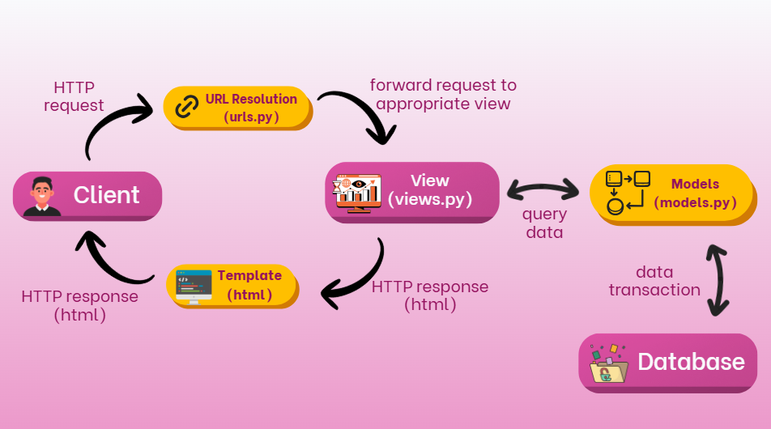

# TUGAS INDIVIDU 2
## PBP 2025/2026

```
Nama  : Nisrina Alya Nabilah
NPM   : 2406425924
Kelas : PBP C
```

Tautan menuju aplikasi PWS yang sudah di deploy : `https://nisrina-alya-xoccerverse.pbp.cs.ui.ac.id/`
Tautan menuju github : `https://github.com/alyaanaazz/xoccer-verse`

### 1. Menjelaskan bagaimana mengimplementasikan **checklist secara step-by-step**
- Saya memulai proyek ini dengan membuat folder terlebih dahulu melalu terminal / command prompt kemudian menginisiasi direktori yang buat ke repository kosong dengan command:
    ```
    C:\Users\nisri>D:
    D:\>cd "FASILKOM UI"
    D:\FASILKOM UI>mkdir xoccer-verse
    D:\FASILKOM UI>cd xoccer-verse
    D:\FASILKOM UI\xoccer-verse> git init\
    ```

- Setelah membuat direktori baru, saya mengaktifkan Virtual Environment (env) untuk mengisolasi package serta dependencies dari aplikasi agar tidak bertabrakan dengan versi lain yang ada pada device saya dengan command:
    ```env\Scripts\activate```

- Setelah mengaktifkan environment, di dalam direktori `xoccer-verse` saya membuat file `requirements.txt` dan menambahkan beberapa dependencies yang dipisahkan di masing-masing line. kemudian saya melakukan instalasi terhadap dependencies yang ada di berkas `requirements.txt` dengan command:
    ```pip install -r requirements.txt```

- Setelahnya, saya membuat proyek django untuk project saya yang bernama `xoccer_verse` dengan command:
    ```django-admin startproject xoccer_verse .```

Setelah membuat proyek Django dengan command tersebut, Django akan membuat struktur direktori dengan folder utama `xoccer_verse` berisi file `settings.py`, `urls.py`, dan lain-lain, serta file `manage.py` di luar folder tersebut.

- Selanjutnya, saya perlu memisahkan fitur ke dalam modul, karena itu, saya membuat apo bernama `main` dengan command:
    ```
    python manage.py startapp main
    ```
setelah itu, folder baru bernama `main` terbentuk dengan struktur `models.py`, `views.py`, `tests.py`, dan `apps.py`.

- Selanjutnya, supaya app `main` dapat dikenali oleh project, saya menambahkan `main` pada variable `INSTALLED_APPS` di file `xoccer_verse/settings.py`:
    ```
    INSTALLED_APPS = [
        ...,
        'main',
    ]
    ```

- Pada `main/models.py`, saya membuat model `Item` dengan atribut berikut:
    ``` 
    class Item(models.Model):
        name = models.CharField(max_length=100)
        price = models.IntegerField()
        description = models.TextField()
        thumbnail = models.URLField(blank=True, null=True)
        category = models.CharField(max_length=20, choices=CATEGORY_CHOICES, default='update')
        is_featured = models.BooleanField(default=False)
        stock = models.IntegerField()
        brand = models.TextField()
        rating = models.FloatField(default=0.0)

        def __str__(self):
            return self.name
    ```
model ini merepresentasikan barang yang dijual di app saya.

- Melakukan migrasi database supaya struktur database sesuai dengan model yang sudah dibuat dengan command:
    ```python manage.py makemigrations```
    ```python manage.py migrate```

- Menambahkan URL routing, dengan membuat file `urls.py` di direktori `main` untuk mapping views nya dengan melakukan:
    ```
    from django.contrib import admin
    from django.urls import path
    from django.urls import path, include

    urlpatterns = [
        path('admin/', admin.site.urls),
        path('', include('main.urls')),
    ]
    ```

- Untuk melakukan test sementara untuk memastikan apakah app nya works, saya menjalankan 
    ```python manage.py runserver```

- selanjutnya, setelah memastikan app saya berjalan lancar, saya membuat file `.gitignore` dan mulai menginisialisasikan ke `Github` supaya file file confidential (seperti env, etc.) tidak ikut ter-push di github saya, lalu melakukan inisialisasi repository ke Github.

- setelah itu, berpedoman dari tutorial 1, saya mengimplemntasikan template dasar dengan membuat direktori templates yang berada di dalam direktori main.

- setelahnya, saya membuat dan mengisi berkas `main.html` sesuai dengan instruksi di dokumen Tugas 2 yang berisi nama apps, serta data diri saya yang meliputi nama, npm, dan kelas PBP saya.

- Selanjutnya saya menambahkan konfigurasi untuk `memulai deployment ke PWS`.

- setelah berhasil melalui proses deployment di PWS, situs web saya untuk Tugas 2 ini sudah siap dikumpulkan melalui tautan berikut : `https://nisrina-alya-xoccerverse.pbp.cs.ui.ac.id/`

- Hampir lupa bikin unit test :p, jadi saya melanjutkan bikin Unit Testing untuk menguji halaman utama, menguji jika client mengakses url yang tidak ada maka Django akan mengeluarkan kode `404 (Not Found)`, menguji pembuatan objek item baru dengan atribut tertentu, menguji nilai default dari model Item, menguji fungsionalitas method `increment_views()`, serta menguji properti `is_hot_sale()` dengan 21 views dianggap hot sale.

### 2. Bagan yang berisi request client ke web aplikasi berbasis Django beserta responnya dan penjelasan kaitan antara urls.py, views.py, models.py, dan berkas html

[Link : https://www.canva.com/design/DAGyAFXXlsM/lKLV6CJ1YqI_PCwj1RIv4Q/edit?utm_content=DAGyAFXXlsM&utm_campaign=designshare&utm_medium=link2&utm_source=sharebutton]
- Setiap request yang masuk akan diproses oleh urls.py dan akan diteruskan ke `views.py` yang sesuai. Jika request berhubungan dengan data, maka `views.py` akan melakukan query ke `models.py` dan `database`. Hasil query akan dikembalikan lagi ke views.py. Setelah itu, hasil yang sudah diperoleh akan dikembalikan lagi ke client dalam bentuk `HTML` sebagai response.

### 3. Peran settings.py dalam proyek Django
[Referensi Jawaban Nomor 3: https://www.colabcodes.com/post/a-complete-guide-to-settings-py-in-django-configuration-for-your-python-web-project]

- berkas `settings.py` di dalam proyek Django bukan hanya configuration file biasa, namun, `settings.py` memiliki peran yang sangat penting untuk proyek Django, beberapa alasannya adalah:
    - Mengontrol Database Configuration, seperti Database engine(e.g MySQL, SQLite, etc.), detail connection seperti user, password, host, dan port yang dalam kasus pbp, para mahasiswa PBP mendapat akses detail connection dari credential yang diterima dari ITF FASILKOM UI, `settings.py` juga mengatur configurations lebih lanjut lainnya.
    - Mengatur `Installed Applications` dan `Middleware`, yang dapat di lihat pada `INSTALLED_APPS` list di `settings.py` di proyek Django dimana Django atau pihak ketiga berperan aktif di proyek Django saat ini.
    - Menyimpan data sensitif keamanan, yang dimana Django akan memerlukan `SECRET_KEY` yang merupakan string penting yang digunakan untuk pengamanan cryptography terhadap keamanan proyek
    - Mengatur behavior proyek di environment yang berbeda dengan beberapa configurations yang berbeda misal DEBUG, etc.

### 4. Cara kerja migrasi database di Django
[Referensi jawaban nomor 4: Django Documentations (https://docs.djangoproject.com/id/5.2//topics/migrations/)]

- Setelah saya melakukan perubahan pada model, misalnya menambahkan atau menghapus model lama, saya akan menjalankan perintah berikut untuk membuat migrasi:
    ```python manage.py makemigrations```
Contoh output:
    ```
    Migrations for 'main':
    main\migrations\0001_initial.py
        + Create model Products
    ```
Pada tahap ini, Django akan memindai model saya, kemudian membandingkan dengan versi yang tersimpan pada berkas migrasi sebelumnya, lalu membuat berkas migrasi baru. Hal yang harus dipastikan ketika membuat migrasi adalah selalu membaca hasil outputnya untuk memastikan perubahan yang terdeteksi sesuai dengan yang diharapkan. Setelah file migrasi berhasil dibuat, jalankan perintah berikut untuk menerapkan migrasi ke database:
    ```python manage.py migrate```
Contoh keluaran:
    ```
    Operations to perform:
    Apply all migrations: admin, auth, contenttypes, main, sessions
    Running migrations:
    Applying main.0001_initial... OK
    ```
Jika migrasi sudah diterapkan dengan baik, commit perubahan model dan berkas migrasi tersebut ke dalam sistem kontrol (github atau pws) dalam satu commit. Dengan begitu, jika ada developer lain (atau server production) yang menarik code tersebut akan langsung mendapatkan model yang telah diperbarui beserta migrasinya.

### 5. Pendapat pribadi terkait alasan framework Django yang dijadikan permulaan pembelajaran pengembangan perangkat lunak dari semua framework yang ada
- Menurut saya, Django dijadikan permulaan dalam pembelajaran pengembangan perangkat lunak karena framework ini lengkap (batteries included) dan terstruktur, sehingga mahasiswa bisa langsung fokus mempelajari konsep inti seperti arsitektur MVT, manajemen database dengan ORM, serta best practice dalam pemisahan logika bisnis, data, dan tampilan tanpa harus repot dengan mengintegrasikan banyak library. Django juga menyediakan fitur keamanan bawaan, dokumentasi yang sangat lengkap, serta komunitas yang besar sehingga memudahkan pemula seperti mahasiswa yang baru memulai journey nya di dunia pengembangan perangkat lunak untuk mencari referensi dan solusi. Selain itu, dengan Django mahasiswa dapat membangun framework web end-to-end mulai dari model, backend, hingga interface sederhana, menjadikannya sarana belajar yang relevan di industri karena banyak digunakan untuk aplikasi berskala besar yang membutuhkan keamanan, kecepatan pengembangan, dan skalabilitas.

### 6. Feedback umtuk asisten dosen tutorial 1 yang sudah saya kerjakan sebelumnya.
- Thank you so much buat Kak Farrell yang selalu ngecek update-an tutorial dari asdosannya walaupun online😭 Dan untuk Tugas 2 ini, shout out juga buat Kak Farrell, karena fast-respond dan sabar banget jawabin nya. Big thanks dan respeecttt kaakk, semoga sehat selalu.